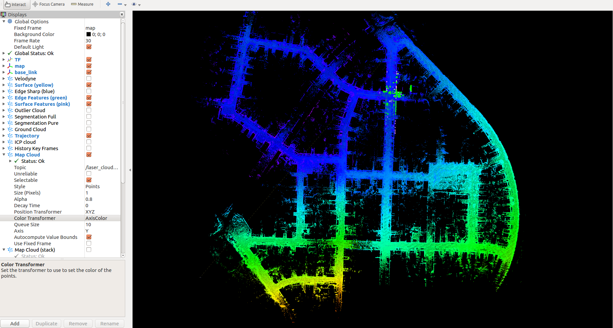
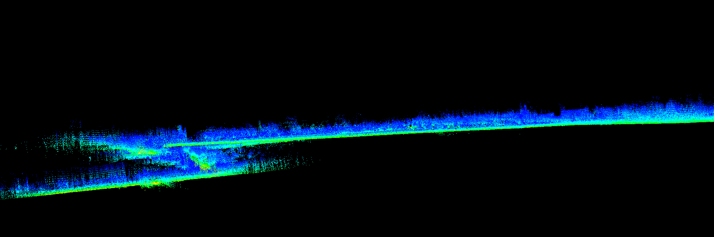

# sc_lego_loam_noted
原项目地址：https://github.com/irapkaist/SC-LeGO-LOAM.git

scan context地址：https://github.com/irapkaist/scancontext.git

我将sc lego loam 代码简单整理了下，并加了些注释，跑了下kitti，效果如下：



**评价：**

测试了几个数据集，包括作者原来给的mulran，还有oxford以及我们实际的场景，校园、城区这种场景直接拿来用还可以，但存在一些问题，简单说明下：

SC LEGO LOAM仅仅只是在LEGO LOAM的基础上，在后端的回环检测部分加入了Scan Context检测回环。基本的逻辑就是先用radius search和时间约束筛选候选帧，判断是否闭环（LEGO LOAM原来的简单方法，比较粗糙）。然后再用Scan context检测是否闭环，最后icp匹配，得到精准的transform，根据icp的score判定是否匹配成功，成功则在位姿图中增加约束。整体上看，scan context是基本都能够检测到闭环的，用起来还不错，需要进一步测试。在一些特定的场景下，闭不上，比如oxford数据集最后的几十帧那个位置。

**使用**

**修改params/lego.yaml里面的pointcloudTopic和激光雷达的分辨率等参数**即可，文件里面给了vlp和oster等激光雷达的参数。注意imu topic就随意设定即可，因为lego loam 的imu部分存在一些问题，如果使用了可能会出现map opxx节点挂掉的情况。

**问题**

注意gtsam的版本为4.0.0-alpha2，否则map_optmization可能会挂掉

```bash
wget -O ~/Downloads/gtsam.zip https://github.com/borglab/gtsam/archive/4.0.0-alpha2.zip
cd ~/Downloads/ && unzip gtsam.zip -d ~/Downloads/
cd ~/Downloads/gtsam-4.0.0-alpha2/
mkdir build && cd build
cmake ..
sudo make install
```

下面是闭环失败的一些场景

